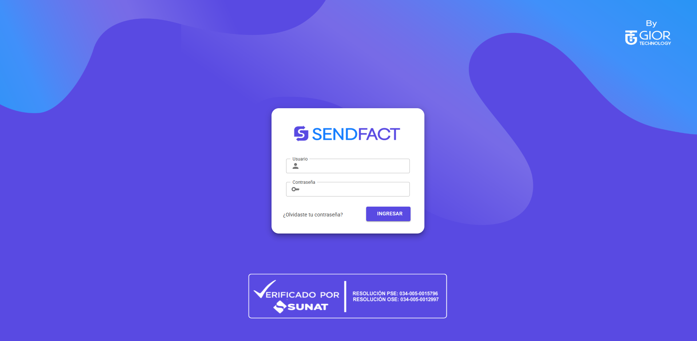

# 🔐 Inicio de Sesión (Login)

La primera pantalla que verás al ingresar al sistema **SendFact** es la de autenticación. Esta pantalla es sencilla y directa, permitiéndote acceder rápidamente a las funcionalidades del sistema.

## 🖥️ Interfaz de Login

La pantalla de inicio de sesión está compuesta por:

- Un campo de texto para el **usuario**.
- Un campo de texto para la **contraseña** (oculta los caracteres).
- Un botón **Ingresar** para validar las credenciales y acceder al sistema.

---

## ❌ Mensaje de Error

En caso de que las credenciales ingresadas no sean correctas, el sistema mostrará el siguiente mensaje de advertencia:

> **Usuario o contraseña inválidos**

Este mensaje te alerta de que alguna de las credenciales no es válida. Puedes reintentarlo asegurándote de que el nombre de usuario y la contraseña sean los correctos.

---

## ✅ Buenas prácticas

- Asegúrate de que la tecla `Bloq Mayús` no esté activada accidentalmente.
- Verifica que tu usuario esté correctamente escrito (evita espacios al inicio o final).
- En caso de olvidar tu contraseña, contacta al correo `mesadeayuda@giorsac.com` para recuperarla.

---

Una vez que ingreses correctamente, accederás a la vista principal del sistema donde encontrarás las pestañas de **Documentos** y **Reportes**.
