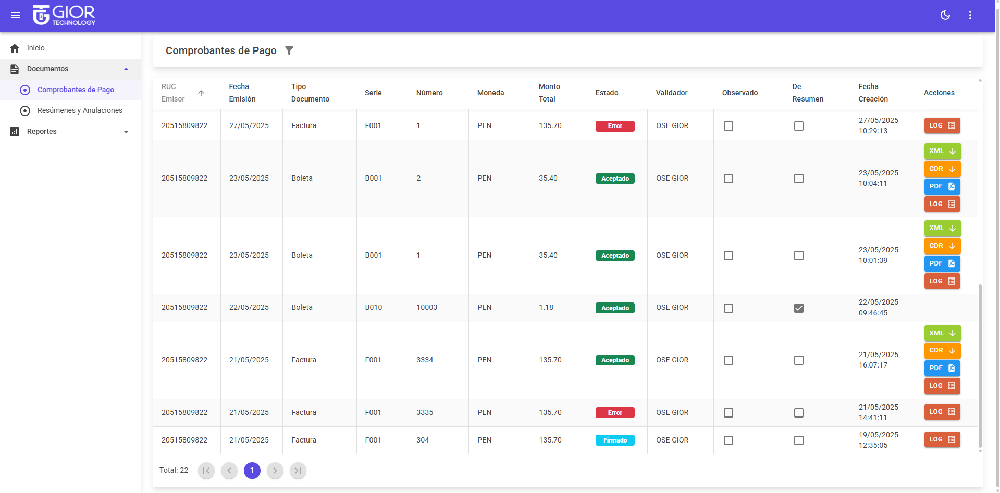
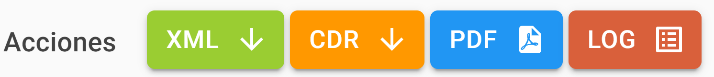
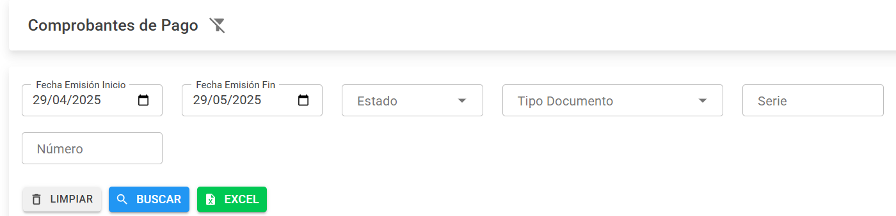

# 2.1 Comprobantes de Pago

La sección **Comprobantes de Pago** muestra todos los documentos electrónicos emitidos por el cliente. Esta vista permite filtrar, visualizar, descargar y verificar el estado de cada comprobante.

---

## 🧾 ¿Qué se muestra?

Aquí se visualiza una tabla con todos los comprobantes emitidos. Las columnas más relevantes incluyen:

- **RUC** del emisor
- **Fecha de emisión**
- **Tipo y número de comprobante**
- **Monto total**
- **Estado del comprobante**
- Acciones disponibles (ver PDF, descargar XML, etc.)

📷 **Ejemplo visual**  

---

## 🔄 Estados del Comprobante

| Estado     | Descripción |
|------------|-------------|
| **Rechazado** | El comprobante fue rechazado por SUNAT. Este estado solo se muestra si se trabaja con SUNAT (no aplica para OSE). SUNAT invalida el correlativo del comprobante. |
| **Aceptado** | El comprobante fue aceptado por SUNAT u OSE. |
| **Anulado** | El comprobante fue anulado mediante un resumen de anulación. |
| **Firmado** | El documento fue firmado digitalmente por el PSE. *Este estado no se muestra si el cliente trabaja solo con OSE.* |
| **Pendiente** | Enviado a SUNAT, pero aún no se ha consultado el estado. |
| **Error** | El comprobante contiene errores. Los detalles se encuentran en la acción **LOG**. |

---

## ⚙️ Acciones disponibles

Cada comprobante cuenta con una serie de botones para realizar diferentes acciones:

- **📄 XML:** Descargar el archivo XML del comprobante.
- **📥 CDR:** Descargar la Constancia de Recepción (CDR) si fue aceptado.
- **📑 PDF:** Ver el comprobante en formato PDF.
- **📋 LOG:** Ver los errores que ocurrieron durante el envío:
  - Fecha y hora del error.
  - Código de error según estándares SUNAT.
  - Descripción técnica del problema.

📷 **Ejemplo visual de acciones**  

---

## 🔎 Filtros de búsqueda

En la parte superior encontrarás filtros para facilitar la búsqueda:

- **Fecha de emisión:** (Inicio y Fin)
- **Estado del comprobante**
- **Tipo de documento**
- **Serie**
- **Número del comprobante**

### 🔘 Botones disponibles:

- **🔄 Limpiar:** Borra todos los campos de los filtros.
- **🔍 Buscar:** Filtra la tabla según los criterios ingresados.
- **📊 Excel:** Descarga los resultados en un archivo Excel.

📷 **Ejemplo visual de los filtros**  

---

## 🧠 Notas adicionales

- Si el comprobante fue enviado a una **OSE**, el estado *Rechazado* no se mostrará. En su lugar, aparecerá un **Error**, y el cliente podrá reenviar el mismo número de comprobante tras corregir los datos.
- El estado **Firmado** aplica únicamente si se usa PSE. Si el sistema trabaja solo con OSE, este estado no se visualiza.

---

✅ ¡Y eso es todo sobre la sección Comprobantes de Pago! Desde aquí puedes gestionar fácilmente los documentos emitidos, consultarlos, corregir errores y generar reportes.

